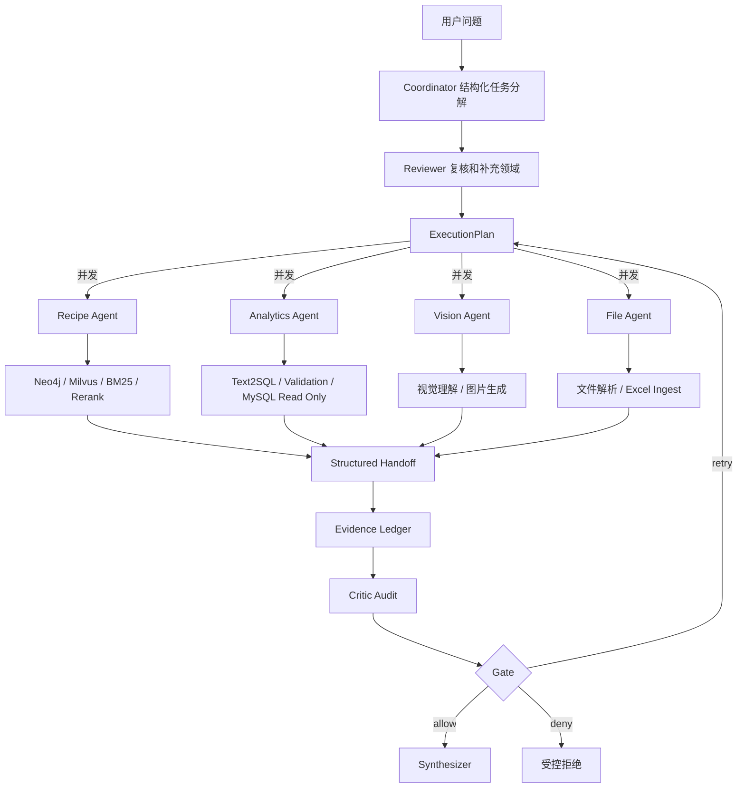
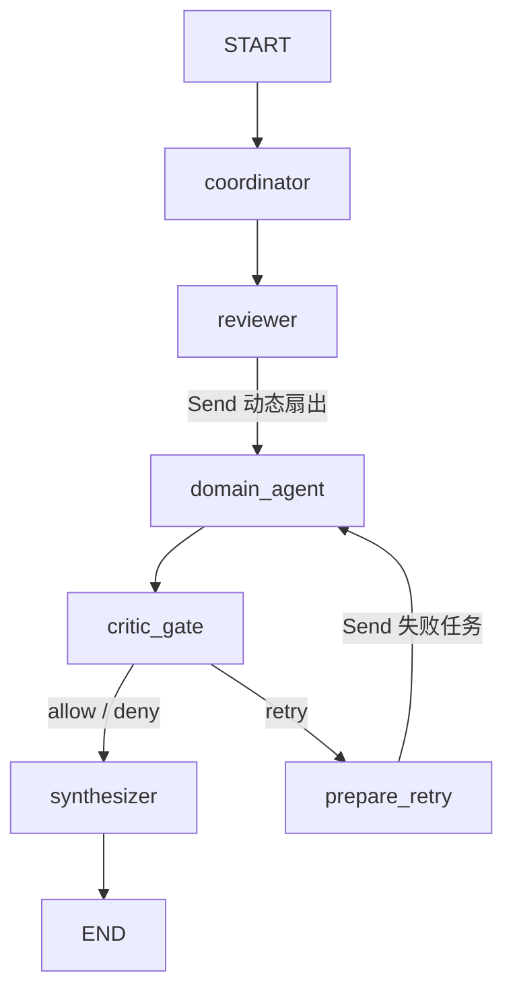

# SmartRecipe DeepReason 架构

## 目标

旧版 GustoBot 的主 Router 每次只选择一个业务分支，适合明确的单意图问题。迁移版保留其 GraphRAG、Text2Cypher、Text2SQL、图片和文件能力，在上层增加 DeepReason 式 Coordinator、Reviewer、Planner、结构化 Handoff、Evidence、Critic 和 Gate，使一个复杂问题可以拆成多个领域任务并发执行。

## 主流程

## 核心合同

- `AgentTask`：任务 ID、领域、自然语言指令、依赖和证据要求。
- `ExecutionPlan`：Coordinator 产生并由 Reviewer 复核的任务集合。
- `Handoff`：领域 Agent 的状态、摘要、结构化输出、证据、错误和耗时。
- `EvidenceItem`：稳定哈希 ID、来源类型、来源、内容、分数和元数据。
- `CriticFinding`：失败、缺证据、危险 SQL 等审计发现。
- `GateDecision`：`allow / retry / deny`，重试次数有上限。

模型定义位于 `gustobot/application/deepreason/models.py`。

## 与原有能力的关系

迁移层不重新实现数据库查询，但也不再把任务送回旧主 Router。`domain_agents.py` 根据已经确认的 `Domain` 选择唯一执行器，`direct_capabilities.py` 负责把领域任务直接转换成目标子图或业务节点的输入，从而复用：

- Recipe Agent：固定 Cypher、Text2Cypher、GraphRAG。
- Analytics Agent：表选择、SQL 生成、SQL validation、只读执行。
- Vision Agent：菜品图片理解和图片生成。
- File Agent：文本/JSON/CSV 解析与 Excel ingest。

### 一次规划，直接分派

`POST /api/v1/deepreason/chat` 的主链路只有一次领域决策：

| Domain | 直接目标 | 是否经过旧 Router |
| --- | --- | --- |
| `recipe` | RAG 子图（predefined Cypher / Text2Cypher / GraphRAG） | 否 |
| `analytics` | Text2SQL 子图 | 否 |
| `vision` | 图片理解/生成节点 | 否 |
| `file` | 文件解析/导入节点 | 否 |
| `general` | 通用回答节点 | 否 |

旧的 `POST /api/v1/chat` 仍保留原 Router，作为兼容入口。两个入口共享底层业务能力，但 DeepReason 主链路不会发生“Coordinator 分派后又由 Router 重新分类”的重复决策。

## 安全和失败处理

领域 Agent 由顶层 LangGraph 的 `Send` 动态扇出并行执行，单个 Agent 异常会被转换成失败 Handoff，不会清空其他成功结果。Critic 会再次扫描 SQL，出现 `DELETE/DROP/UPDATE/INSERT/ALTER/TRUNCATE` 等写操作时 Gate 直接拒绝。普通临时失败通过 `prepare_retry → domain_agent → critic_gate` 条件边最多重试一次，防止无限循环和成本失控。

## 顶层 LangGraph

DeepReason 控制面本身也是一个编译后的 `StateGraph`，状态合同为 `DeepReasonGraphState`：

Coordinator 与 Reviewer 是独立节点；多个 `domain_agent` 在同一 superstep 并行运行，Handoff reducer 按 `task_id` 合并结果；重试结果会替换旧尝试，而不是重复追加。Recipe 与 Analytics 节点内部继续调用各自编译后的 LangGraph 子图，因此整体形成“顶层编排图 + 领域子图”的分层图结构。

## API

- `POST /api/v1/deepreason/chat`：返回答案和完整运行轨迹。
- `GET /api/v1/deepreason/status`：返回已注册领域和上一次运行状态。
- `POST /api/v1/chat`：保留的旧版单路由入口。
