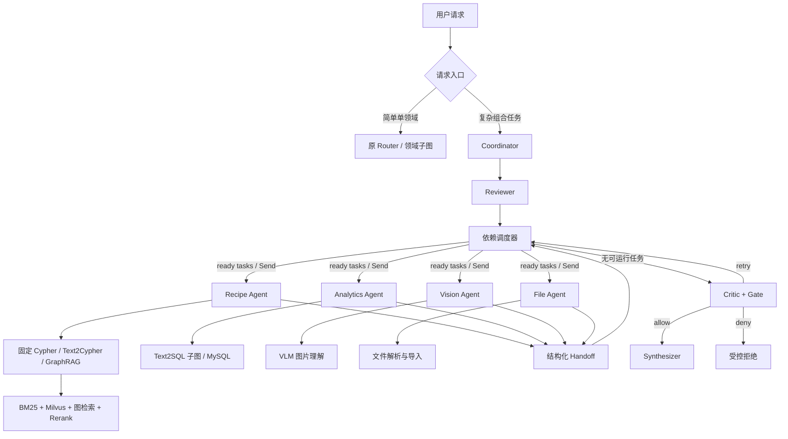
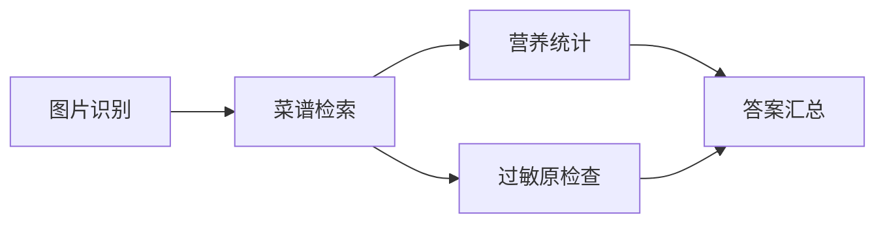

# SmartRecipe 面试复习与升级复盘

> 更新时间：2026-07-28  
> 项目目录：`F:\agent+项目\SmartRecipe-DeepReason\.worktrees\multimodal-dependency-upgrade`  
> 用途：面试前快速恢复项目主线、理解关键设计、识别容易被追问穿的部分。

---

## 0. 先记住这三句话

### 一句话定位

SmartRecipe 不是单纯的“菜谱聊天机器人”，而是一个面向菜谱检索、关系查询、营养统计、图片理解和文件处理的分层 Multi-Agent 决策系统。

### 一句话难点

最核心的难点不是把多个 Agent 串起来，而是解决跨 Agent 的数据依赖：上游菜谱检索必须先产出统一的 `selected_recipe_ids`，下游 Text2SQL 才能在正确的数据范围内计算营养。

### 一句话技术主线

复杂请求先由 Coordinator 生成结构化任务计划，经 Reviewer 复核后，由确定性依赖调度器分批执行 ready tasks；各领域 Agent 通过结构化 Handoff 交换结果，最终经过 Evidence、Critic 和 Gate 再生成回答。

---

## 1. 推荐的项目定位

不建议再使用下面这种空泛表达：

> 为了解决传统应用无法完成复杂推理的问题，搭建多智能体菜谱问答系统。

这句话很容易被反问：“一道菜谱为什么需要复杂推理？”

建议改成：

> 我实现的是一个多数据源的智能食谱决策系统。简单问题直接进入菜谱检索或数据库查询；复杂问题可能同时包含菜谱筛选、关系约束、营养计算、图片理解等任务。系统将复杂请求拆成带依赖的领域任务，通过 LangGraph 调度 GraphRAG、Text2Cypher 和 Text2SQL 等子图，并用结构化 Handoff 保证跨 Agent 数据一致。

### 适合体现系统价值的请求

> 推荐两道包含番茄和鸡蛋、不辣、20分钟内完成的菜，并计算这两道菜的总热量。

这个请求同时包含：

1. 食材、口味、时间等菜谱筛选；
2. 多路检索和候选排序；
3. “选中哪两道菜”的集合确定；
4. 基于这两个 `recipe_id` 的营养聚合；
5. 跨 Agent 数据传递和结果一致性检查。

简单问题，例如“西红柿炒鸡蛋怎么做”，并不需要完整 Multi-Agent 链路。项目保留旧的单路由入口处理简单请求，DeepReason 入口用于复杂组合任务。

---

## 2. 整体架构



### 控制面与数据面

- 控制面：Coordinator、Reviewer、Scheduler、Critic、Gate。
- 数据面：Recipe、Analytics、Vision、File 等领域 Agent，以及它们调用的数据库和检索工具。

控制面决定“做什么、先做什么、失败怎么办”；数据面负责“真正查什么数据、调用什么工具”。

### LangChain 和 LangGraph 如何搭配

- LangChain/LCEL：封装单个 LLM 调用、Prompt、结构化输出、Retriever 和工具。
- LangGraph：管理有状态工作流、节点、条件边、循环、并行 Send、Checkpoint。

可直接回答：

> LangChain 更适合描述一个局部能力，例如结构化 Planner、Text2SQL 生成链或 Rerank 调用；LangGraph 负责把这些能力组织成有状态、可分支、可重试的工作流。项目中领域子图复用 LangChain 组件，顶层 DeepReason 使用 LangGraph 管理跨 Agent 的生命周期。

---

## 3. 贯穿全项目的完整案例

用户请求：

> 推荐两道包含番茄和鸡蛋、不辣、20分钟内完成的菜，并计算两道菜的总热量。

### 第一步：Coordinator 生成结构化计划

示意结构：

```json
{
  "query": "推荐两道包含番茄和鸡蛋、不辣、20分钟内完成的菜，并计算总热量",
  "tasks": [
    {
      "task_id": "recipe-1",
      "domain": "recipe",
      "instruction": "筛选符合食材、辣度和时间约束的菜谱",
      "depends_on": [],
      "result_limit": 2,
      "evidence_required": true
    },
    {
      "task_id": "analytics-2",
      "domain": "analytics",
      "instruction": "计算所选两道菜的总热量",
      "depends_on": ["recipe-1"],
      "evidence_required": true
    }
  ]
}
```

Coordinator 的输出不是自然语言计划，而是 `ExecutionPlan`。这样程序能够校验任务 ID、领域、依赖和结果数量。

### 第二步：Reviewer 检查计划

Reviewer 关注的是：

- 是否漏掉了营养统计任务；
- 是否错误地把一个组合问题当成单领域问题；
- 是否存在缺失的 Recipe/Vision/File/Analytics 能力。

Reviewer 不负责回答问题，也不直接执行工具。它只补充或收紧计划。

### 第三步：Scheduler 只发送 ready tasks

第一次调度：

```text
recipe-1     depends_on=[]          → ready
analytics-2  depends_on=[recipe-1]  → not ready
```

因此第一次只通过 `Send("domain_agent", ...)` 发送 `recipe-1`。

这里的 `Send` 不是 Python 语法，而是 LangGraph 提供的动态分发对象。它告诉图运行时：“为这些输入动态创建同一个节点的多个执行分支。”

### 第四步：Recipe Agent 完成候选检索

菜谱链路根据查询类型选择能力：

- 高频、结构稳定问题：固定 Cypher 模板；
- 灵活关系问题：Text2Cypher；
- 模糊语义推荐：GraphRAG/混合检索。

混合检索中，BM25 和 Milvus 分别产生排名，再通过 RRF 融合，之后调用 Rerank 对候选文档重新排序。

Recipe Agent 不能只返回一段答案，还必须返回结构化候选：

```json
{
  "selected_recipe_ids": ["201000320", "201004552"],
  "recipe_candidates": [
    {
      "recipe_id": "201000320",
      "recipe_name": "西红柿炒鸡蛋",
      "rank": 1,
      "source": "retrieval"
    },
    {
      "recipe_id": "201004552",
      "recipe_name": "番茄鸡蛋汤",
      "rank": 2,
      "source": "retrieval"
    }
  ]
}
```

### 第五步：Handoff 把结果交回调度器

```json
{
  "task_id": "recipe-1",
  "agent": "recipe_retrieval_agent",
  "domain": "recipe",
  "status": "success",
  "output": {
    "selected_recipe_ids": ["201000320", "201004552"]
  },
  "evidence": [],
  "duration_ms": 324.6
}
```

Handoff 的价值是让跨 Agent 交接从“读一段自然语言猜结果”升级为显式数据合同。

### 第六步：第二轮调度执行 Analytics Agent

此时 `recipe-1` 已成功，`analytics-2` 的依赖满足：

```text
analytics-2 → ready
```

Scheduler 将上游输出放入：

```python
context["dependency_outputs"]["recipe-1"]
```

Analytics Agent 从中提取 `selected_recipe_ids`，传入 Text2SQL 子图。它不再让 LLM 从用户原问题中重新猜是哪两道菜。

### 第七步：Text2SQL 限定查询范围

目标 SQL 类似：

```sql
SELECT SUM(total_calories)
FROM recipes
WHERE canonical_recipe_id IN ('201000320', '201004552');
```

系统使用 `sqlglot` 解析 AST，验证：

- 只能有一条 SELECT；
- 必须引用 `recipes`；
- 必须使用 `canonical_recipe_id`；
- ID 集合必须与上游完全一致；
- 不允许用 `OR`、`NOT`、子查询或集合运算扩大范围。

这解决了“菜谱 Agent 选了 A、B，SQL Agent 却统计了其他菜”的跨 Agent 一致性问题。

### 第八步：Critic 和 Gate

领域 Agent 完成不等于可以直接回答。系统还检查：

- 是否有计划任务没有终态 Handoff；
- 是否有任务失败；
- 需要证据的任务是否返回证据；
- SQL 是否包含写操作；
- 依赖是否合法、是否存在循环。

Gate 结果只有：

```text
allow  → 允许生成答案
retry  → 只重试失败或缺证据的任务
deny   → 停止输出业务结论
```

---

## 4. 最值得讲的升级点

| 初版问题 | 简单方案 | 当前升级 | 工程价值 |
|---|---|---|---|
| 单 Router 只能选一个分支 | 为每个问题固定走一条链 | Coordinator 将复杂问题拆成多个 `AgentTask` | 支持组合意图 |
| 所有任务一次性并行 | LangGraph Send 全量扇出 | `depends_on` + ready-task 分批调度 | 解决真实数据依赖 |
| Agent 之间传自然语言 | 下游从上游回答中重新抽取 | 结构化 `Handoff.output` | 降低语义漂移 |
| Neo4j 和 MySQL 使用不同内部主键 | 用菜名做 JOIN | 统一 `canonical_recipe_id` | 跨存储一致性 |
| BM25、向量分数量纲不同 | 原始分数加权求和 | RRF 按排名融合 | 避免分数不可比 |
| Text2SQL 只靠 Prompt | 提示模型“只生成 SELECT” | Schema、语法、安全、AST 范围和执行前校验 | 防止错表、错列和越权 |
| 一个 Agent 失败导致整体不清楚 | 捕获异常后返回通用错误 | 失败 Handoff、独立重试、依赖后代 SKIPPED | 可诊断、可恢复 |
| 工具成功就直接回答 | 只相信 LLM 自检 | Evidence Ledger + 确定性 Critic/Gate | 增加可审计性 |
| 长会话无限累积 | 永远携带完整历史 | Token 预算、滑动窗口、动态摘要、Redis Checkpoint | 控制成本和状态隔离 |

### 最应该重点讲的三个

1. 依赖调度与结构化 Handoff；
2. 菜谱检索的 BM25 + Milvus + RRF + Rerank；
3. 上游 `selected_recipe_ids` 对 Text2SQL 的范围约束。

这三点能够组成一条完整的数据流，不是简单罗列技术名词。

---

## 5. 依赖调度：最关键的架构升级

### DAG 是什么

DAG 是 Directed Acyclic Graph，有向无环图。

- 有向：任务之间存在明确先后方向；
- 无环：不能出现 A 等 B、B 又等 A；
- 图：一个任务可以依赖多个上游，也可以产生多个下游。

示例：



### ready task 的判断条件

任务可执行必须满足：

1. 自己还没有成功执行；
2. 所有 `depends_on` 指向的任务都存在；
3. 所有依赖任务状态都是 `SUCCESS`；
4. 如果上游声明必须有证据，则上游 Handoff 必须带证据；
5. 如果是重试，不能超过 retry budget。

### State 会自动循环吗

不会。

LangGraph 的 State 只是各节点共享的数据容器。图会循环，是因为代码显式定义了：

```text
scheduler → domain_agent → scheduler
```

每个 Agent 完成后产生新的 Handoff，调度器再次读取最新 State，重新计算 ready tasks。

### 并行和协作的区别

- 并行：多个任务同时运行；
- 协作：一个任务能够使用另一个任务的结构化输出。

菜谱内部的 BM25、向量和图关系检索可以并行，因为它们都只依赖原始查询。营养统计不能和菜谱选择并行，因为它依赖最终选中的 `recipe_id`。

### 失败如何处理

- 上游临时失败且还有预算：只重试上游；
- 上游最终失败：下游标记为 `SKIPPED/dependency_failed`；
- 一个独立分支失败：不影响无依赖关系的其他分支；
- 依赖 ID 不存在：执行前 `DENY`；
- 出现循环依赖：执行前 `DENY`；
- 重试结果按 `task_id` 替换旧 Handoff，避免重复结果。

### 为什么调度规则不用 LLM

“依赖是否完成、重试是否超限、是否存在环”都有明确答案，确定性代码成本低、可测试、可复现。LLM 适合生成计划，不适合决定安全底线和状态迁移。

---

## 6. 菜谱检索链路

### 三类图查询能力

#### 固定 Cypher

适用于结构固定、频率高、可提前验证的请求。

例如：

```text
查询某道菜的食材
查询指定食材关联的菜谱
查询菜谱烹饪步骤
```

优点是稳定、快速、安全；缺点是覆盖范围有限。

#### Text2Cypher

适用于结构明确但组合方式灵活的问题。

例如：

> 查询包含鸡蛋但不含花生、20分钟内完成的非辣菜谱。

流程：

```text
读取图 Schema
→ LLM 生成 Cypher
→ 语法检查
→ 写操作检查
→ 关系方向纠正
→ Neo4j 执行
```

#### GraphRAG/综合关系检索

适用于模糊推荐、语义匹配、实体关系共同参与的问题。

例如：

> 有哪些清淡、适合减脂、又能用冰箱现有食材制作的菜？

它综合语义检索、关键词检索和图关系扩展，不只依赖一条动态 Cypher。

### Chunk、BM25 和 Milvus

离线阶段：

```text
Neo4j/菜谱文件
→ 生成菜谱文档
→ 切分 Chunk
→ BM25 初始化词项统计
→ Embedding
→ 写入 Milvus
```

- BM25 在 Chunk 文本上做关键词匹配，当前实现使用 LangChain `BM25Retriever`，主要在进程内维护，并不是“BM25也存在Milvus里”。
- Embedding 将 Chunk 转成向量，向量和元数据写入 Milvus。
- Neo4j 保存菜谱、食材、步骤及其关系。
- 三者存的是同一业务实体的不同检索投影，不是三份完全相同的数据。

### “建索引”是什么意思

索引是为了避免每次查询都扫描全部数据。

- BM25 索引：记录词在哪些 Chunk 出现、出现频率和区分度；
- Milvus 向量索引：组织高维向量，使近邻搜索不需要逐个比较；
- Neo4j 图索引：加速通过节点 ID、属性和关系定位图数据。

### 为什么用 RRF

BM25 分数、向量相似度和图相关度量纲不同，直接相加需要人工校准权重。RRF 只使用每条链路的排名：

```text
RRF(d) = Σ 1 / (k + rank_i(d))
```

常用 `k=60`，用于降低头部排名的一次波动。

例子：

```text
菜谱A：只在BM25排第1
RRF(A) = 1 / 61 ≈ 0.01639

菜谱B：BM25排第5，Milvus排第5
RRF(B) = 1 / 65 + 1 / 65 ≈ 0.03077
```

因此 B 更高，因为它被两条独立召回路径共同支持。

### Rerank 在哪一层

RRF 用于多路候选融合，Rerank 用更强的语义模型重新判断“用户问题与候选文档”的相关性。

推荐顺序：

```text
每路召回较多候选
→ 每路按 recipe_id 去重
→ recipe_id 级 RRF
→ 取 Top-N 菜谱
→ Rerank
→ 选择每道菜最有证据价值的 Chunk
→ 拼装上下文
```

### 为什么 Neo4j 不完全换成 MySQL

不是因为 6000 个节点“量太大”，这个规模 MySQL 完全能存。

Neo4j 的理由是查询形态：

- 菜谱—包含—食材；
- 食材—可替代—食材；
- 菜谱—属于—菜系；
- 菜谱—使用—厨具；
- 食材—关联—过敏原。

当问题需要变长关系路径或邻居扩展时，图查询比多层 JOIN 更直接。营养聚合、评分排序等表格计算仍然适合 MySQL。

可直接回答：

> 选 Neo4j 不是因为数据规模，而是因为关系查询的形态；选 MySQL 不是因为它更传统，而是因为聚合统计和事务结构更适合关系库。两者通过 canonical_recipe_id 对齐。

---

## 7. Text2SQL 如何保证准确和安全

### 完整链路


### 第一层：查询边界

先判断问题是否属于菜谱数据库范围。超出范围则不生成 SQL。

### 第二层：动态 Schema

从 MySQL `INFORMATION_SCHEMA` 读取真实表和字段，根据用户问题筛选相关表，减少无关 Schema 对模型的干扰。

### 第三层：生成约束

Prompt 中注入：

- 数据库类型；
- 表、字段和关系；
- 领域字段说明；
- 上一次失败 SQL 和校验错误；
- 上游传来的菜谱范围。

### 第四层：程序校验

当前实现包括：

- 非空和基础语法检查；
- 只允许 SELECT/WITH；
- 危险关键词检测；
- 表名和列名是否存在；
- `sqlglot` AST 解析；
- 上游 `recipe_id` 闭集校验；
- 禁止多语句、集合运算和范围扩大。

### 第五层：有界纠错

SQL 校验失败后，将“上次 SQL + 具体错误”反馈给生成节点，最多重试固定次数。不是简单重复同一个 Prompt。

### 第六层：执行前二次阻断

即使上一步误放行，执行节点仍会重新判断是否只读，验证没通过则不会访问数据库。

### 仍可继续加强

- 使用数据库只读账号，从权限层禁止写操作；
- 为每次查询设置 statement timeout；
- 强制最大返回行数；
- 对复杂 SQL 使用 `EXPLAIN` 评估代价；
- 对敏感字段做列级白名单和脱敏；
- 将全部安全判断统一迁移到 AST，减少字符串正则的边界问题。

---

## 8. Evidence、Critic 和 Gate

### Evidence 什么时候产生

每个领域 Agent 执行完成后，适配器从工具结果中提取证据：

- RAG 文档 → `retrieval` Evidence；
- SQL 语句和查询行 → `sql` Evidence；
- Cypher 和图记录 → `cypher` Evidence。

Evidence ID 由任务、来源和内容的稳定哈希生成，用于去重、追踪和回放。

它不是一个单独文件夹中的手工 JSON。运行时通过 `EvidenceLedger` 追加到 JSONL 账本，同时也保存在 Handoff 中。

### Critic 是不是幻觉检测

当前更准确的定义是“结构化结果审计”，而不是完整语义幻觉检测。

它擅长确定性检查：

- 任务有没有执行；
- 工具是否失败；
- 证据是否缺失；
- SQL 是否危险；
- 依赖是否合法。

它目前不能完整证明一句自然语言 Claim 是否被证据语义蕴含。

### 为什么 Gate 不直接让 LLM 决定

Gate 负责能否发布结果，是最后一道安全边界。确定性规则可复现、可单测、成本低；LLM 可以辅助发现问题，但不应独占最终安全决定。

### 生产级 Claim-Evidence 升级

如果继续升级幻觉检测，推荐：

```text
领域Agent输出原子Evidence
→ Synthesizer生成结构化 cited_claims
→ 程序先检查 evidence_id 是否存在
→ 数值/ID/布尔约束由程序验证
→ 只有无法规则判断的语义Claim交给LLM Judge
→ unsupported/contradicted触发定向修复
```

关键原则：

- 不要让 LLM 连续做“生成、抽取、匹配、裁决”四遍；
- 生成答案时直接要求输出 `claim + evidence_ids`；
- 能由程序比较的时间、热量、辣度、食材集合不调用 LLM；
- LLM 只处理“是否适合新手”等软语义。

---

## 9. 多轮会话与上下文工程

### 三层状态

1. LangGraph State：当前一次图执行中的节点状态；
2. Redis Checkpoint：按 `thread_id` 保存会话图状态，支持会话隔离和恢复；
3. 长期记忆：通过 Mem0 按 `user_id` 保存偏好等跨会话信息。

### Token 管理

当前上下文模块包含：

- Token 计数；
- 滑动窗口裁剪；
- 超阈值后对旧消息动态摘要；
- 保留最近若干条原始消息；
- 为 system、history、retrieval 和输出分别预留预算；
- Schema 相关性过滤；
- 大段检索结果渐进压缩。

### 为什么摘要不能替代全部原文

摘要可能丢失实体和数值。因此系统：

- 保留最近消息原文；
- 摘要 Prompt 强制保留食材、菜名、过敏原和数值约束；
- 结构化业务状态放在 State/Handoff 中，不只依赖自然语言历史。

---

## 10. 图文处理如何讲

当前主链路的图片理解流程：

```text
图片文件
→ Pillow读取并转RGB
→ 必要时缩放和压缩
→ JPEG字节
→ Base64
→ data:image/jpeg;base64,...
→ qwen3-vl-plus
→ 图片描述/食材识别/菜品判断
```

Base64 不是模型的视觉特征，它只是把本地二进制图片放入 HTTP/JSON 请求的一种传输编码。

### 为什么 VLM 之后还可能查知识库

VLM 擅长“看到了什么”，但不能保证：

- 菜谱名称与内部 `recipe_id` 对齐；
- 烹饪时间来自数据库；
- 热量和过敏原信息准确；
- 回答符合项目知识范围。

所以完整链路应是：

```text
VLM抽取视觉线索
→ 生成结构化食材/菜品候选
→ Recipe Agent检索标准菜谱
→ 必要时Analytics Agent查询营养
```

### CLIP 当前如何定位

仓库中已经有本地 CLIP 编码器合同和 Milvus 图片向量仓储适配器，并通过 Fake Runtime/Fake Client 测试；但 VLM 文本召回 + CLIP 视觉召回 + recipe_id 级 RRF 尚未形成完整真实联调链路。

面试以 VLM 图片理解链路为主，不主动把 CLIP 双路检索说成已经完整上线。

---

## 11. 数据库分别存什么

| 组件 | 保存内容 | 主要用途 |
|---|---|---|
| Neo4j | 菜谱、食材、步骤、菜系、厨具及关系 | 图关系查询、Text2Cypher、GraphRAG |
| MySQL | 菜谱结构化字段、营养、评分、时间等 | 聚合、统计、Text2SQL |
| Milvus | Chunk Embedding 和检索元数据 | 语义向量召回 |
| Redis Stack | 会话状态、LangGraph Checkpoint | 会话隔离、恢复 |
| MinIO | Milvus 的对象数据依赖 | Milvus 内部存储 |
| etcd | Milvus 元数据和协调信息 | Milvus 内部依赖 |

这些数据库不是互相替代，而是同一领域数据的不同服务形态。跨存储通过稳定的 `canonical_recipe_id` 对齐。

---

## 12. 数据清洗和离线索引怎么讲

### 数据处理流水线

```text
菜谱Markdown/结构化源数据
→ 编码与格式校验
→ 提取菜名、食材、用量、步骤、时间等字段
→ 单位和名称归一化
→ 生成稳定 canonical_recipe_id
→ 写入Neo4j节点与关系
→ 写入MySQL结构化字段
→ 从图谱/文档生成检索Document
→ 切分Chunk
→ 构建BM25检索器
→ 生成Embedding并写入Milvus
```

### 哪些是离线完成的

- 原始数据清洗；
- 图谱节点和关系构建；
- Chunk 生成；
- Embedding 计算；
- Milvus Collection 和向量索引构建；
- BM25 初始语料加载。

在线阶段只负责接收查询、调用已构建索引、融合候选和生成回答。

### recipe_id 在什么时候产生

应在数据标准化之后、写入多个存储之前产生。不能让 Neo4j、MySQL 和 Milvus 分别生成自己的业务 ID，否则跨 Agent Handoff 无法稳定关联。

---

## 13. 部署和启动问题

### 环境

- Windows 11；
- Python 3.12；
- `uv` 管理依赖和虚拟环境；
- FastAPI/Uvicorn 启动 API；
- Docker Compose 管理 MySQL、Neo4j、Redis Stack、Milvus、MinIO、etcd。

### uv 是什么

`uv` 是 Python 项目和依赖管理工具。它读取 `pyproject.toml` 和 `uv.lock`，创建/同步虚拟环境，保证项目依赖版本可复现。

它不是“保证系统 Python 一定正确”，而是尽量让项目使用自己隔离的 `.venv` 和锁定依赖。

### 常用命令

```powershell
cd F:\agent+项目\SmartRecipe-DeepReason\.worktrees\multimodal-dependency-upgrade

uv sync
docker compose up -d
docker compose ps

.\.venv\Scripts\python.exe scripts\check_environment.py --all
.\.venv\Scripts\python.exe -m uvicorn main:app --host 127.0.0.1 --port 8000
```

API 文档：

```text
http://127.0.0.1:8000/docs
```

### 为什么使用 Docker Compose

项目依赖多个服务，手工安装容易出现端口、版本和配置不一致。Compose 使用一份 YAML 描述所有服务、端口、网络、Volume 和依赖关系，适合本地一键复现。

---

## 14. 评测指标应该怎么解释

### 当前可复现结果

- 全仓库自动化测试：`143 passed`；
- SmartRecipe DeepReason、调度、Text2SQL 范围和 Rerank 合同相关：`59 passed`；
- 30 条离线路由集：exact domain-set match 为 `30/30`。

### exact domain-set match 是什么

如果标准答案需要 `{recipe, analytics}`，系统也必须完整输出这两个领域，少一个或多一个都算错。

它只评估任务领域拆解，不代表：

- 最终回答正确率；
- 检索 Recall@K；
- 幻觉率；
- 线上意图识别准确率。

### 为什么“58个事实覆盖55个”不是检索 Recall@K

检索 Recall@K 需要：

- 每个问题的 Gold `recipe_id` 或相关文档集合；
- 明确的 K；
- 检查 Gold 是否出现在 Top-K。

55/58 更接近最终回答的关键事实覆盖率，因为它同时受到检索、生成和答案组织影响。

### 检索层推荐指标

- Recall@K：相关菜谱是否进入候选；
- MRR：第一个正确菜谱排得多靠前；
- NDCG@K：多个相关菜谱的整体排序质量；
- RRF 前后 Recall/NDCG 对比；
- Rerank 前后 NDCG 对比；
- p50/p95 检索延迟。

---

## 15. 哪些部分仍偏 Toy，以及怎么升级

### 1. RRF 还不是完整的菜谱级聚合

当前 RRF 已按 `node_id` 融合 BM25 和 Milvus 排名，但同一道菜如果出现多个 Chunk，仍可能重复贡献分数；不同路径的证据元数据也没有完整合并。

生产级升级：

```text
每条召回路径内部先按 recipe_id 去重
→ 每道菜只保留本路径最高排名
→ recipe_id级RRF
→ 保留各路径最佳Chunk作为证据
→ Rerank菜谱或代表Chunk
```

### 2. Critic 不是完整的语义幻觉检测

当前主要检查结构、失败、证据存在性和危险 SQL；如果把 Agent 自己的回答也当 Evidence，证据强度不足。

生产级升级：

- `agent_output` 不能满足强证据要求；
- Evidence 增加可信等级；
- 答案直接输出 `cited_claims`；
- 数值和集合由程序验证；
- 软语义才调用 LLM Judge。

### 3. Reviewer 对所有复杂请求都执行，成本仍可优化

生产级可根据计划置信度和风险决定：

- 高置信度单领域：直接执行；
- 多领域或有依赖：进入 Coordinator；
- 关键槽位缺失：先澄清；
- 高风险/低置信度计划：再调用 Reviewer。

### 4. 多模态链路主要是 VLM 图片理解

CLIP、图片 Milvus Collection 和双路 RRF 目前不是完整真实链路。若面试岗位不强调视觉，可以只讲 VLM 如何把图片线索接入已有菜谱检索，不必强行扩展。

### 5. 缺少真实基础设施联调证据

当前本机 Docker Engine 未运行，MySQL、Neo4j、Redis 和 Milvus 没有完成本轮真实联调。要形成部署证据，需要保存：

- `docker compose ps`；
- 初始化数据统计；
- Milvus Collection 行数；
- 一次真实 API Trace；
- 一次故障注入和恢复记录；
- 环境与模型版本。

### 6. 检索评测仍需 Gold Label

不能只用答案覆盖率代替检索指标。至少构建 30～50 条问题，标注相关 `recipe_id`，比较：

```text
BM25 only
Milvus only
BM25 + Milvus + RRF
RRF + Rerank
```

---

## 16. 30秒介绍

> SmartRecipe 是一个基于 LangGraph 的分层 Multi-Agent 食谱决策系统。我主要升级了复杂任务编排和多源检索链路。系统将复杂问题拆成带 `depends_on` 的结构化 AgentTask，由确定性调度器只执行依赖满足的 ready tasks；菜谱侧融合固定 Cypher、Text2Cypher、BM25、Milvus 和图关系检索，经过 RRF 与 Rerank 生成统一 `selected_recipe_ids`，再通过结构化 Handoff 驱动 Text2SQL 做营养统计。最后使用 Evidence Ledger、Critic 和 allow/retry/deny Gate 处理证据缺失、任务失败和危险 SQL。

---

## 17. 两分钟介绍

> 这个项目最初是一个基于 Router 的菜谱问答系统，能够把问题分到菜谱检索、Text2SQL、图片或文件处理子图。但初版存在一个问题：单路由适合单意图，复杂问题即使拆成多个 Agent，一次性并行也不等于协作。
>
> 例如“推荐两道菜并计算总热量”，营养统计必须知道上游最终选中了哪两道菜。我在任务模型中增加 `depends_on` 和 `result_limit`，由 Coordinator 生成结构化 ExecutionPlan，Reviewer 检查领域遗漏，再由确定性 Scheduler 计算 ready tasks。第一次只执行 Recipe Agent；它从固定 Cypher、Text2Cypher 和 GraphRAG 链路获取候选，BM25 与 Milvus 结果通过 RRF 融合并经过 Rerank，最终输出统一的 `selected_recipe_ids`。Scheduler 收到成功 Handoff 后才执行 Analytics Agent。
>
> Analytics Agent 不再从自然语言重新猜菜名，而是接收上游 ID。Text2SQL 子图会读取真实 Schema、生成 SQL、检查表列、危险操作和语法，并使用 sqlglot 验证 SQL 的 `canonical_recipe_id` 范围必须与上游完全一致。每个 Agent 都输出结构化 Handoff 和 Evidence；Critic 检查任务失败、缺证据、非法依赖及危险 SQL，Gate 再决定放行、有界重试或拒绝。
>
> 这个升级让我真正理解了 Multi-Agent 的重点不是 Agent 数量，而是任务依赖、数据合同、状态调度、证据和失败路径。

---

## 18. 可能问的问题

### Q1：为什么不直接用一个大模型？

一个模型可以生成看似合理的回答，但复杂问题同时涉及图查询、SQL 聚合和安全校验。拆分后每条链可以独立限制权限、验证结果、重试和定位故障。简单问题仍走单领域链路，不强行 Multi-Agent。

### Q2：这是固定工作流还是 Plan-and-Execute？

领域子图内部是相对固定的受控工作流；顶层是受约束的 Plan-and-Execute。Planner 动态产生任务集合和依赖，Scheduler 按依赖执行，但领域能力和安全边界是预先注册的。

### Q3：Router 和 Coordinator 有什么区别？

Router 主要回答“这个问题进入哪个分支”；Coordinator 回答“这个复杂目标需要哪些任务、每个任务的输入是什么、任务之间有什么依赖”。

### Q4：Reviewer 有什么用？

它做计划级复核，检查 Coordinator 是否漏掉必要领域。它不直接回答，也不能绕过程序的依赖和安全规则。

### Q5：为什么 Reviewer 不就是又调一次 LLM？

所以 Reviewer 不应无条件用于所有简单问题。它适合多领域、低置信度或高风险计划；安全和依赖最终仍由确定性代码校验。

### Q6：LangGraph Send 是什么？

Send 是动态分发机制。调度函数返回多个 `Send("domain_agent", state)`，LangGraph 会用不同输入并行执行同一个领域节点。它不是 Python 关键字。

### Q7：Scheduler 是不是一直轮询数据库？

不是。它位于 LangGraph 状态图中，每个 domain_agent 完成后沿显式边回到 scheduler。Scheduler 读取当前 State/Handoff，再计算下一批 ready tasks。

### Q8：为什么要 Handoff？

Handoff 是跨 Agent 数据合同，包含任务 ID、状态、结构化输出、证据、错误和耗时。没有 Handoff，下游只能从自然语言中重新抽取，会造成 ID、数值和范围漂移。

### Q9：为什么不让 Recipe 和 Analytics 并行？

独立统计可以并行；“这两道菜的总热量”依赖菜谱选择结果，必须等待上游 `selected_recipe_ids`。是否并行取决于数据依赖，不取决于 Agent 名称。

### Q10：RRF 为什么比直接加分好？

BM25、向量相似度和图分数的量纲不同；RRF只依赖排名，不需要先校准不同模型的原始分数，并能奖励被多路共同召回的候选。

### Q11：BM25 和 Embedding 都在 Milvus 里吗？

不是。当前 BM25Retriever 在 Chunk 文本上维护关键词统计；Embedding 向量写入 Milvus。二者检索后再按排名融合。

### Q12：为什么还要 Rerank？

RRF解决多路分数不可比；Rerank用更强的跨编码语义判断重新比较问题和候选。两者解决的问题不同。

### Q13：为什么需要 Neo4j？

不是因为节点数量大，而是因为菜谱、食材、替代关系、菜系、厨具和过敏原之间存在可变关系路径。关系遍历用图查询更自然；营养聚合仍交给 MySQL。

### Q14：Text2SQL 生成错了怎么办？

先做 Schema 和安全校验；失败后把原 SQL 和具体错误反馈给生成节点进行有界重试；超过预算则不执行。执行节点还会进行第二次只读检查。

### Q15：如何防止 SQL 查错菜？

Recipe Agent 输出统一 `selected_recipe_ids`；Analytics Agent只接收声明依赖的上游输出；SQL AST 必须包含与这些 ID 完全一致的 `canonical_recipe_id` 正向过滤条件。

### Q16：Critic 是另一个 LLM 吗？

当前核心 Critic 是确定性审计代码，检查失败、缺证据、非法依赖和危险 SQL。语义 Claim 检查可以引入 LLM Judge，但最终 Gate 不完全依赖 LLM。

### Q17：证据什么时候产生？

领域工具执行完成后，在 Handoff 适配层从 Document、SQL/Cypher 语句和执行结果中提取，并生成稳定 Evidence ID。

### Q18：任务失败如何处理？

可恢复失败在预算内只重试对应任务；最终失败会阻断依赖它的下游并标记 SKIPPED；无依赖的其他分支继续执行；关键依赖或安全错误使 Gate 拒绝。

### Q19：如何管理长会话？

Redis Checkpoint按 thread_id 隔离状态；上下文模块按 Token 预算保留最近消息，旧历史触发动态摘要，结构化业务变量保存在 State/Handoff 中，避免全部依赖摘要文本。

### Q20：项目最有价值的部分是什么？

不是 Agent 数量，而是把“菜谱检索结果驱动营养统计”做成可验证的数据依赖：统一 ID、结构化 Handoff、确定性调度、SQL范围约束和失败传播共同保证跨 Agent 一致性。

---

## 19. 面试前代码阅读顺序

1. `gustobot/application/deepreason/models.py`  
   看 `AgentTask`、`ExecutionPlan`、`Handoff`、`EvidenceItem`。

2. `gustobot/application/deepreason/planning.py`  
   看结构化 Planner、Reviewer 和业务依赖补全。

3. `gustobot/application/deepreason/scheduling.py`  
   看 ready tasks、缺失依赖、循环依赖和 SKIPPED 传播。

4. `gustobot/application/deepreason/orchestrator.py`  
   看 LangGraph 节点、Send、循环边、Critic 和 Gate。

5. `gustobot/application/deepreason/direct_capabilities.py`  
   看 `selected_recipe_ids` 如何从 Recipe 传给 Analytics。

6. `gustobot/application/agents/rag_sub_graph/components/graph_rag/rag_modules/hybrid_retrieval.py`  
   看 BM25、Milvus 和 RRF。

7. `gustobot/application/agents/text2sql_sub_graph/sql_validation/node.py`  
   看 SQL 安全和 `recipe_id` 范围校验。

8. `tests/test_deepreason_scheduling.py`  
   用测试理解正确执行顺序和失败路径。

9. `tests/test_deepreason_handoff_integration.py`  
   看 Recipe → Analytics 的最小集成案例。

10. `tests/test_text2sql_recipe_scope.py`  
    看 OR、NOT、子查询等范围绕过为什么会被拒绝。

---

## 20. 自己必须能回答的五个检查题

1. 为什么第一次调度只能执行 `recipe-1`，不能执行 `analytics-2`？
2. `Send`、普通函数调用和 LangGraph Edge 分别是什么？
3. `selected_recipe_ids` 从哪里产生，经过哪些对象传到 Text2SQL？
4. RRF 为什么不使用 BM25 和向量的原始分数？
5. Critic、Gate 和完整的语义幻觉检测有什么区别？

如果这五题不能脱离资料讲清楚，不要继续背更多名词，先回到贯穿案例重新走一遍。

---

## 21. 当前验证记录（个人备忘，不作为开场话术）

2026-07-28 在当前工作区执行：

```powershell
uv sync
.\.venv\Scripts\python.exe -m pytest -q
```

结果：

```text
143 passed, 2 warnings
```

聚焦 SmartRecipe DeepReason、Text2SQL Scope 和 Rerank：

```text
59 passed
```

离线路由评测：

```text
metric: exact domain-set match
total: 30
exact_matches: 30
accuracy: 1.0
```

当前 Docker Desktop Engine 未运行，`.env` 未配置真实数据库连接，本轮未完成 MySQL、Neo4j、Redis、Milvus 和真实模型的端到端联调。

---

## 22. 下一步最值得补的三件事

1. 启动 Docker Compose，完成一次真实 Recipe → Handoff → Text2SQL 端到端 Trace；
2. 建立带 Gold `recipe_id` 的检索集，跑 BM25、Milvus、RRF、Rerank 消融实验；
3. 将 RRF 升级为每路先按 `recipe_id` 去重，并禁止 `agent_output` 作为强 Evidence。

完成这三项后，项目最容易被追问的“数据库是否真跑过、RRF是否真提升、Evidence是否只是形式”才有直接证据。
