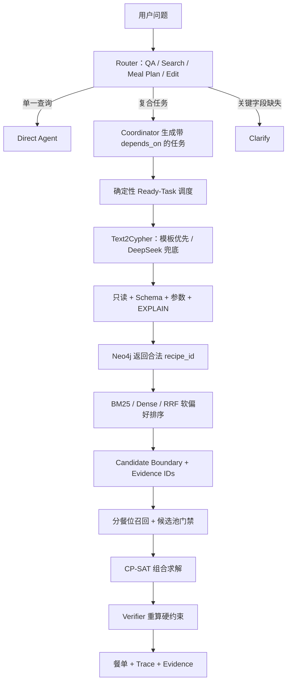

# SmartRecipe Text2Cypher 与餐单规划复习

## 一句话架构

这不是一个 LLM Supervisor 自由调用所有 Agent 的系统，而是 **Router + Plan-and-Execute + 确定性 DAG 调度**：LLM 理解语言和抽取结构，代码负责依赖、安全、数据边界和求解。

## Task 7–10 分别解决什么

### Task 7：安全 Text2Cypher

问题：LLM 可能生成写操作、虚构 Schema、漏参数或语法错误。

处理：高频查询优先走参数化模板；动态语句依次经过只读安全、Schema、参数完整性和 Neo4j `EXPLAIN`。只把检查错误反馈给 LLM 做有界修复，不无限循环。

### Task 8：图边界和混合排序

问题：BM25 和 Dense 能对“清淡、高蛋白”排序，但不能保证“必须含 A 且不含 B”。

处理：Text2Cypher 先返回合法 `recipe_id` 集合，作为 Graph Gate。BM25 和 Dense 只在这个合法集合内排序，RRF 融合排名。图结果为空就返回空，图查询失败就阻断，不静默放宽过敏原等硬约束。

### Task 9：Evidence Ledger

问题：最终选中的菜谱必须能追溯到“哪次查询、哪条记录和哪个字段”。

处理：Neo4j 查询产生 query-level evidence，每个菜谱产生 atomic evidence，`CandidateBoundary` 保存 `recipe_id -> evidence_ids`。它主要解决来源追溯和审计，不等于最终约束验证。

### Task 10：候选验收、CP-SAT 和 Verifier

问题：检索到的菜不代表能组成合法的多日餐单。

处理：先检查单道菜的必要字段、过敏冲突和时长；再检查早/午/晚各餐位是否有足够不同候选，不足时定向补召回；最后 CP-SAT 在所有可行组合中选择餐单。Verifier 从 `RecipeCandidate` 原始事实重算热量、蛋白质、时间、重复次数等，防止输入映射或输出拼装错误。

## 一个请求如何跑

用户：“规划 7 天高蛋白清淡餐，不含花生，每餐 30 分钟内。”

1. Router 判断为 `meal_plan`，约束提取成 Pydantic 对象，业务校验缺少关键字段则进入 Clarify。
2. 花生是硬约束，Text2Cypher 用参数化语句圈定不含花生的 `recipe_id`。
3. “高蛋白、清淡”是软偏好，BM25/Dense/RRF 在合法 ID 内排序。Dense 就是向量检索，它对语义相似好，但不负责硬性否定。
4. 按 breakfast/lunch/dinner 分别召回。7 天且每道菜最多重复 2 次时，每个餐位至少需要 `ceil(7/2)=4` 道不同候选，并加安全缓冲。
5. CP-SAT 为每个“天-餐位-菜谱”建 0/1 变量，求解热量、蛋白质、时间和重复次数同时满足的组合。
6. Verifier 重算；通过后返回餐单、Trace 和 evidence IDs。

## 30 秒版

我把原来的菜谱问答升级为约束餐单规划系统。架构上采用 Router + Plan-and-Execute，复合任务由带 `depends_on` 的确定性 DAG 调度。检索上用参数化 Cypher/Text2Cypher 处理食材包含和排除等硬约束，BM25 和 BGE-M3 处理软偏好排序，合法候选再交给 CP-SAT 组合求解和 Verifier 重算。在 30 条冻结关系查询上，模板主链路的逻辑精确匹配和执行成功率均为 100%，15 条安全样本全部拦截，P95 为 56 ms。

## 2 分钟版

这个项目的难点不是让 LLM “想出一份餐单”，而是在真实数据上保证过敏原、营养、时间和重复次数等约束。我用分层 Router 区分单一查询、复合规划和需要澄清的请求；复合请求由 Coordinator 生成带依赖的任务，调度器只执行依赖已完成的 ready tasks。

数据检索上，我没有让 BM25 或向量检索承担“不含花生”这种硬约束，而是先用 Neo4j 图关系查询圈定合法 `recipe_id`。高频关系查询走参数化模板，长尾问题才调 DeepSeek 生成 Cypher；所有动态语句都经过只读安全、Schema、参数和 `EXPLAIN` 检查，失败时有界修复。合法 ID 内再用 BM25/BGE-M3/RRF 排序软偏好。

检索结果通过 Candidate Boundary 与 Evidence Ledger 进入 MealPlanningAgent，系统按餐位检查候选覆盖，再由 CP-SAT 寻找合法组合，最后 Verifier 从原始菜谱事实重算。我还建了版本化评测 Harness：在 30 条冻结关系查询上，模板链路逻辑精确匹配和执行成功率均为 100%，15 条安全样本拦截率 100%，P95 56 ms。我也做了 DeepSeek development 消融，正确性相同但 P50 约 20.27 秒，因此最终选择模板优先、LLM 兜底。

## 三层追问

1. **为什么不全用 LLM？** 高频查询结构稳定，模板更快、可测试、可审计；LLM 保留给长尾语义。
2. **`EXPLAIN` 是不是预编译？** 它类似执行前语法/计划检查，会构建查询计划但不执行读写数据；不等于数据库驱动层的 prepared statement。
3. **Graph Gate 是 GraphRAG 吗？** 不是完整 GraphRAG。当前是 Neo4j 结构化图查询 + 合法 ID 门禁 + 文本排序；尚未实现子图扩展、社区摘要和图证据生成。
4. **Evidence 和 Verifier 不重复吗？** Evidence 回答“事实从哪来”；Verifier 回答“最终组合是否违反约束”。
5. **100% 是不是题太简单？** 它是模板可覆盖的结构化关系子任务，用于验证可靠性和防回归；不代表端到端问答 100%。
6. **为什么还要 CP-SAT？** 检索只会找单道相关菜，CP-SAT 才能在 21 个餐位上同时处理全局约束和目标。

## 代码阅读入口

- `gustobot/application/meal_planning/text2cypher/service.py`：模板、检查、EXPLAIN、执行和修复主链路。
- `gustobot/application/meal_planning/retrieval_router.py`：硬约束边界与 BM25/Dense/RRF 路由。
- `gustobot/application/meal_planning/candidate_pool.py`：Candidate Boundary、分餐位请求、覆盖门禁和定向补召回。
- `gustobot/application/meal_planning/agent.py`：检索、候选验收、CP-SAT、Verifier 与 Evidence 串联。
- `scripts/run_text2cypher_benchmark.py`：真实评测 Harness。
